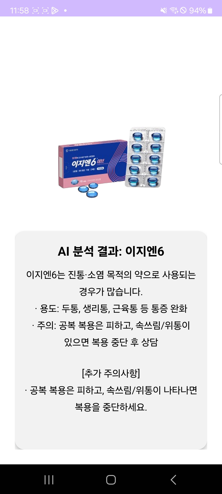
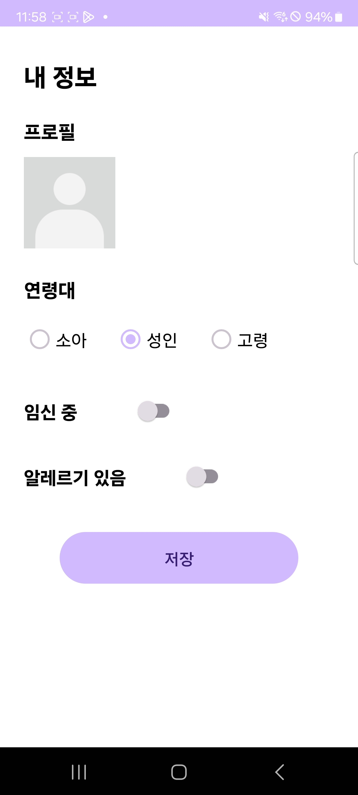

# 💊 SafePill

카메라로 알약을 촬영하면 약의 종류를 분석하고,  
사용자의 **연령대 · 임신 여부 · 알레르기 정보**를 반영해  
개인 맞춤형 복용 주의사항을 안내하는 AI 기반 알약 정보 앱입니다.

---

## 📚 목차
- [📽️ 데모 영상](#-데모-영상)
- [🖼️ 앱 실행 화면](#-앱-실행-화면)
- [⚙️ 주요 기능 요약](#-주요-기능-요약)
- [📦 프로젝트 구성](#-프로젝트-구성)
- [💻 설치 방법](#-설치-방법)
- [🧰 기술 스택](#-기술-스택)
- [📱 테스트 환경](#-테스트-환경)
- [📝 사용법](#-사용법)
- [👩‍💻 프로그래머 정보](#-프로그래머-정보)
- [🐞 버그 및 디버그 정보](#-버그-및-디버그-정보)
- [🚀 버전 및 업데이트](#-버전-및-업데이트)
- [🔗 참고 및 출처](#-참고-및-출처)
- [📜 라이선스](#-라이선스)
- [❓ FAQ](#-faq)

---

## 📽️ 데모 영상
[](https://youtube.com/shorts/gKXrew_Xky8?feature=share)


---

## 🖼️ 앱 실행 화면
| 메인 화면 | 분석 결과 | 내 정보 |
|---|---|---|
|  |  |  |

---

## ⚙️ 주요 기능 요약
- 📷 **알약 인식 기능**  
  카메라로 알약 촬영 → 서버 분석 → 약 이름 및 기본 정보 출력
- 🧑‍⚕️ **개인화 정보 반영**  
  연령대 / 임신 여부 / 알레르기 유무에 따라 추가 주의사항 표시
- 🚨 **119 버튼**  
  실제 신고 연결 없이 전화 **다이얼 화면만 실행**
- 📜 **결과 화면 스크롤 지원**  
  주의사항이 길어져도 스크롤로 전체 확인 가능
- 🌐 **GPT API 연동**  
  사전 정의된 5종 알약에 대한 정보 제공

---

## 📦 프로젝트 구성

| 구분 | 파일/폴더 | 설명 |
|---|---|---|
| 앱 | `MainActivity.kt` | 카메라 촬영, 119 다이얼, 내 정보 이동 |
| 앱 | `ResultActivity.kt` | 약 분석 결과 및 주의사항 표시 |
| 앱 | `ProfileActivity.kt` | 연령대/임신/알레르기 정보 입력 |
| 네트워크 | `AnalyzeApi.kt` | 이미지 분석 API 인터페이스 |
| 네트워크 | `RetrofitClient.kt` | 서버 통신 설정 |
| UI | `activity_main.xml` | 메인 화면 UI |
| UI | `activity_result.xml` | 결과 화면 UI |
| UI | `activity_profile.xml` | 내 정보 화면 UI |
| 백엔드 | `backend/main.py` | GPT API 기반 약 정보 분석 서버 |

---

## 💻 설치 방법
1. 본 레포지토리를 클론합니다.
2. Android Studio에서 프로젝트를 엽니다.
3. `RetrofitClient`의 `BASE_URL`을 해당 네트워크 IPV4 서버 주소로 설정합니다.
4. 에뮬레이터 또는 실제 기기에서 실행합니다.

---

### 🚀 Backend 실행

```bash
python -m uvicorn main:app --reload --host 0.0.0.0 --port 8000
```

---

## 🧰 기술 스택

| 구분 | 사용 기술 |
|---|---|
| 앱 개발 | Android (Kotlin) |
| UI 구성 | XML, ConstraintLayout, Material Design |
| 네트워크 | Retrofit2, OkHttp |
| AI 분석 | GPT API (이미지 기반 분석) |
| 백엔드 | FastAPI (Python) |
| 기타 | GitHub, Android Studio |

---

## 📱 테스트 환경

| 항목 | 환경 |
|---|---|
| 테스트 기기 | Android 실기기 |
| OS | Android 13 이상 |
| 개발 환경 | Android Studio |
| 서버 실행 | 로컬 FastAPI 서버 |

---

## 📝 사용법

1. 앱 실행 후 **카메라 버튼**을 눌러 알약 촬영  
2. AI 분석 결과와 함께 **약 정보 및 주의사항 확인**  
3. 위험 상황 시 **119 버튼**을 눌러 다이얼 화면 이동  
4. **내 정보 탭**에서 연령대 / 임신 여부 / 알레르기 정보 입력  
5. 개인 정보에 따라 **맞춤 주의사항 자동 반영**

---

## 👩‍💻 개발자 정보

| 이름 | 역할 |
|---|---|
| 강승우 | Android 앱 개발, UI/UX 설계, GPT API 연동 |
| 박다현 | Android 앱 개발, 백엔드 구성 |

---

## 🐞 버그 및 한계점

- 알약 인식은 **사전 정의된 5종 알약만 지원**
- 실제 의료 판단을 대체하지 않음
- 네트워크 상태에 따라 분석 지연 발생 가능
- 알레르기 기능은 현재 ‘있음/없음’만 지원함  
  → 추후 **알레르기 종류(예: 진통소염제(NSAIDs), 특정 성분, 피부/호흡기 반응 등)**를 선택하거나 직접 입력하게 하여, 결과 화면에서 약별로 더 정교한 주의사항을 제공할 수 있음


---

## 🚀 버전 정보

| 버전 | 내용 |
|---|---|
| 1.0.0 | GPT API 기반 알약 인식 기능 구현 |
| 1.1.0 | 내 정보 기반 개인화 주의사항 추가 |

---

## 📜 라이선스

본 프로젝트는 **학습 및 과제 제출 목적**으로 제작되었습니다.  
의료 정보는 참고용이며, 실제 복용 전에는 반드시 전문가와 상담해야 합니다.

---

## ❓ FAQ

**Q. 실제로 119에 전화가 연결되나요?**  
A. 아니요. 다이얼 화면만 열리도록 구현되어 있습니다.

**Q. 모든 알약을 인식할 수 있나요?**  
A. 아닙니다. 현재는 5종의 알약만 인식 가능합니다.

**Q. 의료용으로 사용해도 되나요?**  
A. 본 앱은 참고용이며 의료 행위를 대체하지 않습니다.

